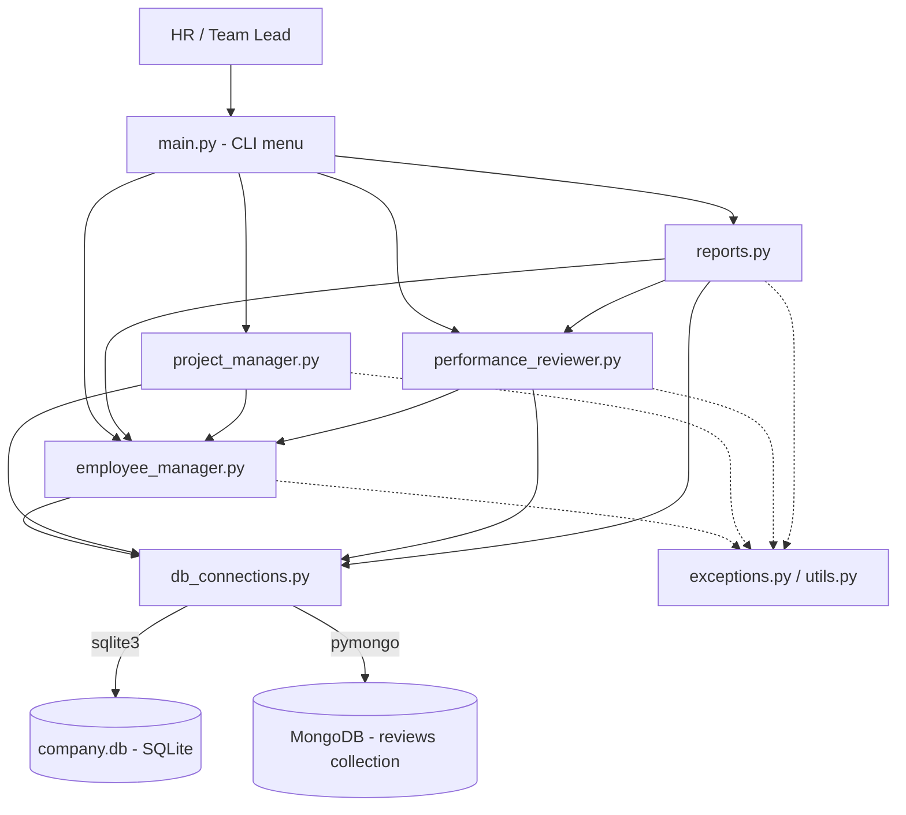
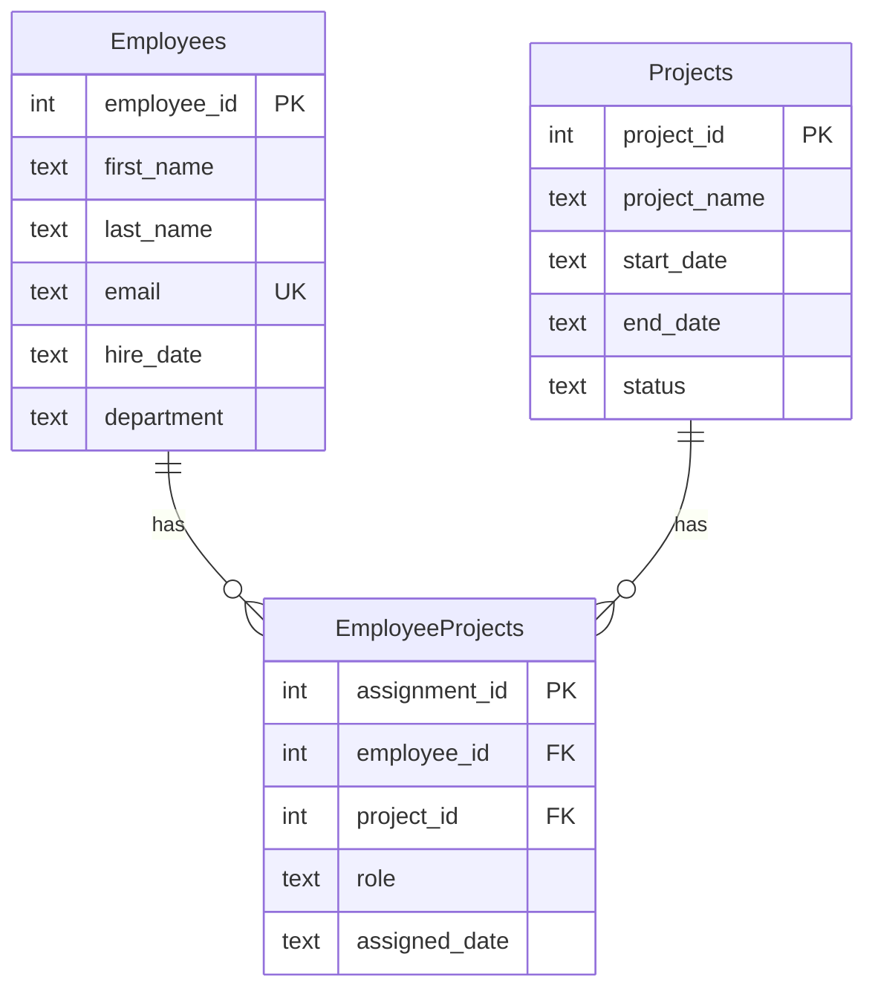

# Architecture & Design

## Purpose
A small command-line system for HR / team leads to onboard employees, assign
them to projects, record performance reviews and view reports.

**Polyglot persistence** is used on purpose:

| Data | Store | Why |
|------|-------|-----|
| Employees, Projects, Assignments | **SQLite (SQL)** | Fixed shape, relationships, needs integrity (unique email, foreign keys) |
| Performance reviews | **MongoDB (NoSQL)** | Review fields vary by role and change over time; documents allow new fields without migrations |

## Architecture diagram



## Layers
1. **Presentation** - `main.py` (menu, input(), friendly error messages)
2. **Business logic** - `employee_manager`, `project_manager`, `performance_reviewer`, `reports`
3. **Data access** - `db_connections.py` (only place that knows how to connect)
4. **Storage** - SQLite file + MongoDB collection

## SQL schema (ER diagram)



### Type & constraint rationale
- `INTEGER PRIMARY KEY AUTOINCREMENT` - unique, auto-generated IDs.
- `TEXT` dates in ISO `YYYY-MM-DD` - SQLite has no DATE type; ISO text sorts and compares correctly.
- `email UNIQUE COLLATE NOCASE` - prevents duplicates regardless of capitalisation.
- `NOT NULL` on required columns; `end_date` is nullable (project may be open-ended).
- `status CHECK (...)` - only allowed values; default `'Planning'`.
- `CHECK (end_date >= start_date)` - no project ends before it starts.
- `EmployeeProjects` is a **junction table** (many-to-many): one employee, many projects; one project, many employees.
- `UNIQUE (employee_id, project_id)` - no duplicate assignment.
- `FOREIGN KEY ... ON DELETE CASCADE` + `PRAGMA foreign_keys = ON` - no orphan rows.

## MongoDB document (collection `reviews`)
```json
{
  "employee_id": 1,
  "review_date": "2024-12-01",
  "reviewer_name": "Meena S",
  "overall_rating": 4.5,
  "strengths": ["Teamwork", "Coding"],
  "areas_for_improvement": ["Documentation"],
  "comments": "Great year.",
  "goals_for_next_period": ["Lead a module"],
  "leadership_score": 8
}
```
`leadership_score` shows schema flexibility: extra fields can appear in some
documents only. An index on `employee_id` makes lookups fast.
`employee_id` links to SQL (checked in Python before saving, since MongoDB has no foreign keys).

## Error handling
Custom exceptions (`exceptions.py`) -> raised by modules -> caught in `main.py` and shown as `❌ message`.
